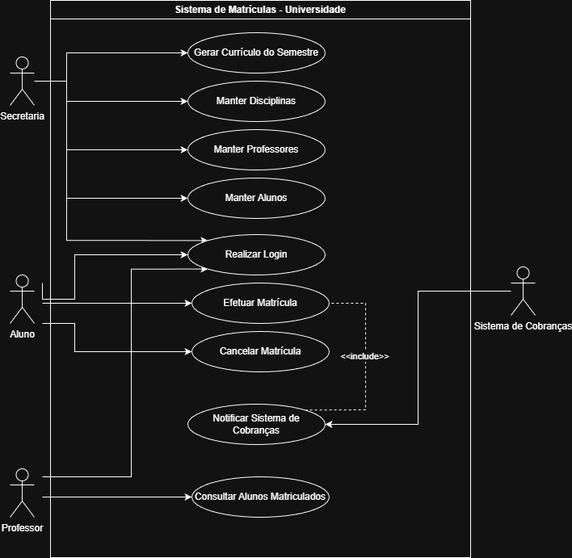

# Sistema de Matrículas - Laboratório de Desenvolvimento de Software

## Diagrama de Casos de Uso

---

## Histórias de Usuário (Sprint 01)

**US01 - Autenticação de Usuários**
Como um usuário do sistema (Aluno, Professor ou Secretaria), 
Desejo fazer login utilizando uma senha, 
Para garantir que minhas informações e ações no sistema sejam seguras e validadas.

**US02 - Gerenciamento de Dados Acadêmicos**
Como funcionário da Secretaria, 
Desejo manter as informações sobre disciplinas, professores, alunos e gerar o currículo de cada semestre, 
Para organizar a oferta acadêmica da universidade.

**US03 - Realização de Matrículas**
Como Aluno, 
Desejo me matricular em até 4 disciplinas obrigatórias (1ª opção) e até 2 disciplinas optativas durante o período de matrículas, 
Para montar minha grade curricular do semestre.

**US04 - Cancelamento de Matrículas**
Como Aluno, 
Desejo acessar o sistema para cancelar matrículas feitas anteriormente (dentro do período de matrículas), 
Para ajustar minha grade caso eu mude de ideia.

**US05 - Fechamento e Validação de Turmas**
Como Sistema de Matrículas, 
Desejo cancelar automaticamente disciplinas com menos de 3 alunos inscritos e encerrar as inscrições de disciplinas que atingirem 60 alunos, 
Para garantir a viabilidade das turmas ofertadas.

**US06 - Integração com Faturamento**
Como Sistema de Matrículas, 
Desejo notificar o Sistema de Cobranças assim que um aluno se inscrever em um semestre, 
Para que o aluno seja devidamente cobrado pelas disciplinas cursadas.

**US07 - Consulta de Turmas**
Como Professor, 
Desejo acessar o sistema para visualizar a lista de alunos matriculados em cada uma das minhas disciplinas, 
Para ter controle sobre quem frequentará minhas aulas.
